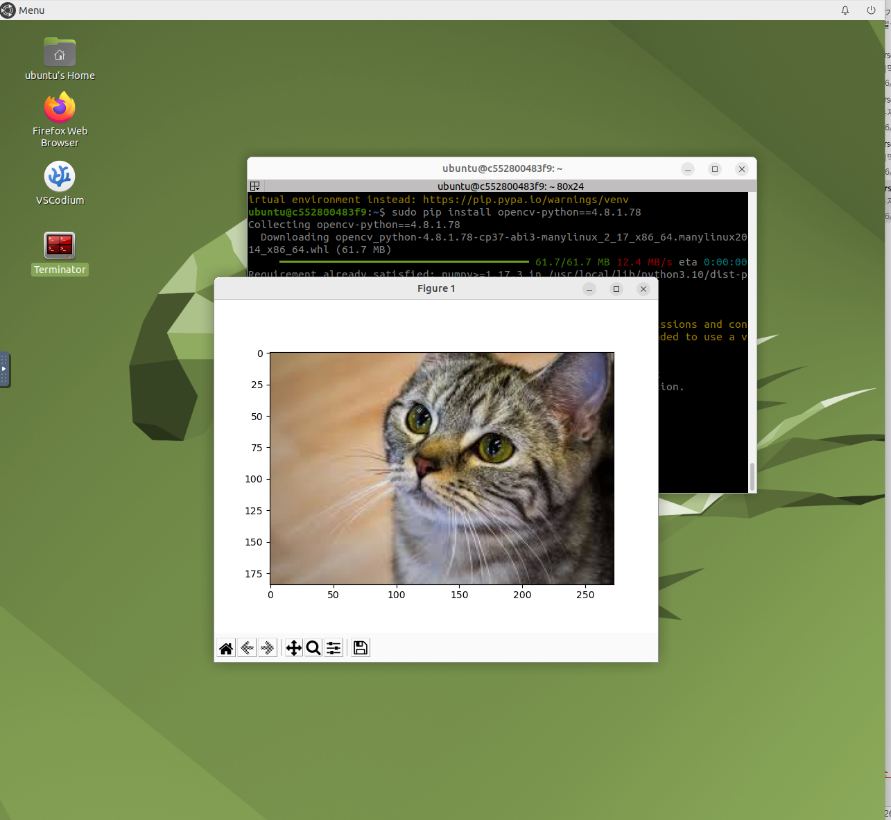
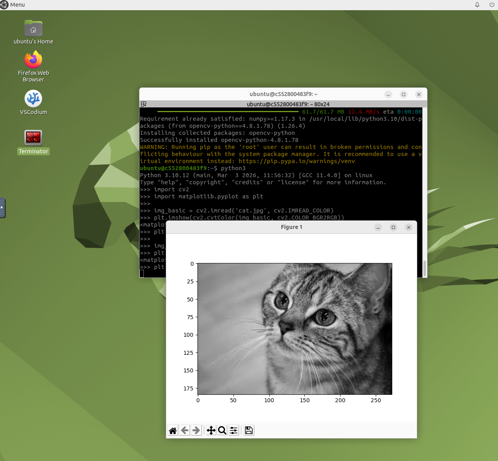

"Docker"一词指代了多个概念，包括开源社区项目、开源项目使用的工具、主导支持此类项目的公司 Docker Inc.，以及该公司官方支持的工具。这些技术和公司的同名可能会造成混淆。
以下简要说明 Docker 以便区分：

IT 软件"Docker"是支持创建和使用 Linux® 容器的容器化技术。

开源 Docker 社区致力于改进这类技术，并免费提供给所有用户，使之获益。

Docker Inc. 公司凭借 Docker 社区产品起家，主要负责提升社区版本的安全性，并将技术进步与广大技术社区分享。此外，它还专门对这些技术产品进行完善和安全固化，以服务于企业客户

