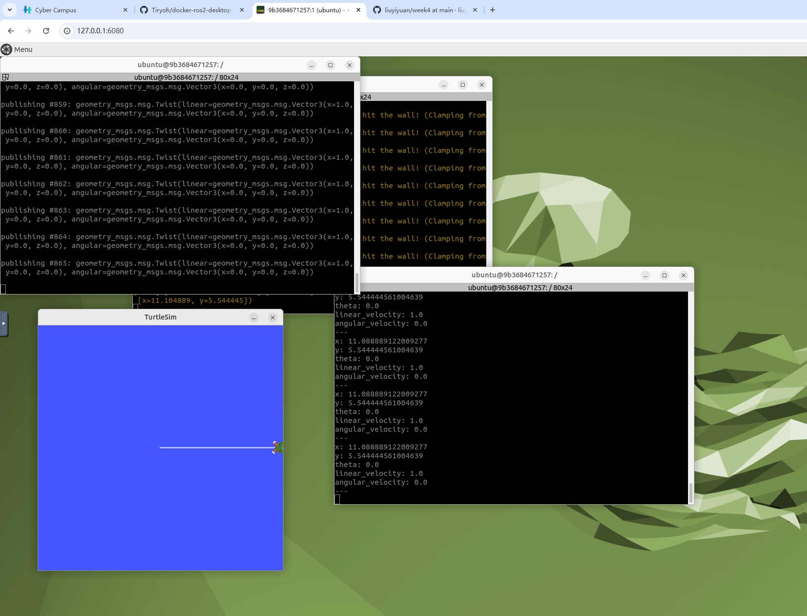

# liuyiyuan
本周主要围绕开发环境配置、版本管理工具以及容器化技术与机器人系统基础展开学习与实践，具体内容如下：

一、Git 与 GitHub 基础操作

本周学习并实践了 Git 的基本操作流程，包括仓库初始化、文件添加、提交以及远程推送等操作。在 GitHub 平台上完成代码仓库的创建与管理，并在 Ubuntu 终端中使用 Git 命令进行版本控制实践。

重点掌握了 git add、git commit、git push 等核心操作流程，并在实践过程中解决了部分命令使用错误问题，从而加深了对版本控制机制及其工作流程的理解。

二、Ubuntu 终端与目录操作

进一步熟悉了 Ubuntu 系统的命令行操作，包括文件与目录的查看、切换与管理等基础命令，如 ls、cd、pwd 等。通过实际操作，加深了对 Linux 文件系统结构与路径概念的理解，同时提升了在终端环境下进行开发与调试的能力。

三、VS Code 开发环境使用

学习并使用 Visual Studio Code 进行代码编写与项目管理，并结合终端进行程序运行与调试。初步掌握了在 VS Code 中集成终端、管理项目文件结构以及提升开发效率的方法，增强了整体开发体验的便捷性与规范性。

四、Docker 与 ROS2 基础实践

学习了 Docker 的基本概念及其在环境隔离与部署中的作用，并进行了初步实践操作。在实验过程中尝试运行 ROS2 容器镜像，在容器环境中执行基础命令及测试节点，初步体验了 Robot Operating System 2（ROS2）的运行方式及其通信机制，对机器人开发环境的构建方式有了更直观的理解。

五、本周总结

总体而言，本周通过理论学习与实践操作相结合的方式，完成了开发环境的基础搭建与多种开发工具的初步使用，包括 Git 版本管理、Linux 终端操作、VS Code 开发环境配置以及 Docker 与 ROS2 的基础实践。整体提升了在 Linux 环境下进行软件开发与机器人系统操作的能力，为后续深入学习机器人开发与系统设计奠定了良好基础。
