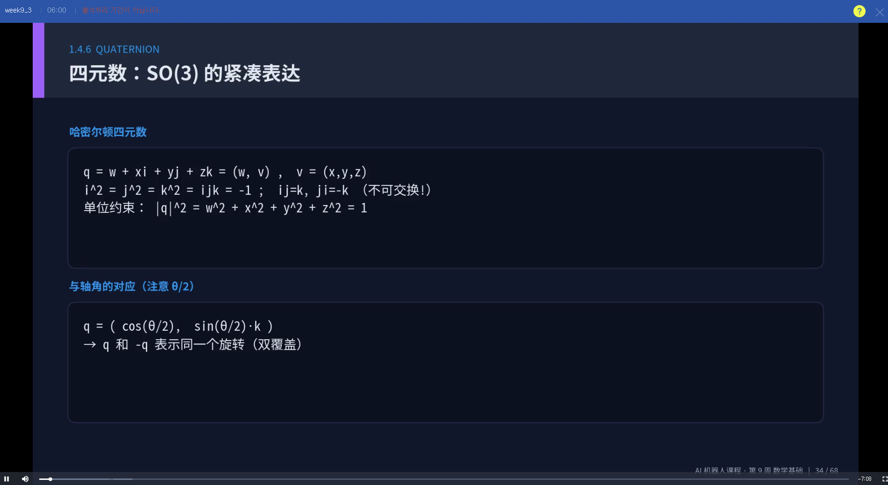

# week9
1. 为什么机器人需要数学？
机器人需要用数学模型描述位置、姿态、速度和运动过程。
例如坐标变换可以表示机器人从一个位置移动到另一个位置。

2. 旋转矩阵
二维旋转矩阵可以表示平面中点的旋转：

R = [[cosθ, -sinθ], [sinθ, cosθ]]

3. 机器人运动学
机器人运动学主要研究机器人位置、速度和关节之间的关系。
常见内容包括正运动学、逆运动学和雅可比矩阵。

4. 机器视觉数学
机器视觉中常用图像矩阵、卷积、特征提取等方法处理图像信息。

5. 路径规划
常见路径规划算法包括 BFS、Dijkstra、A*、RRT 和 DWA。

